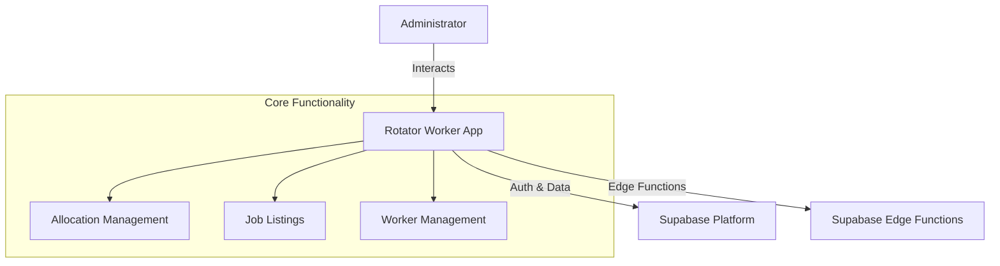

# Rotator Worker (Admin Portal)

:::info Legacy Application
This Flutter application serves as the **temporary backend administration interface** until Phase 2 of the frontend redevelopment project. It is currently the primary tool for administrators to manage job lines, workers, and allocation runs.
:::

## 📋 Overview

**Rotator Worker** provides backend administration capabilities for hospital administrators and workforce managers. 

### Key Responsibilities
- **Job Line Management**: Create, edit, and archive job line definitions.
- **Worker Administration**: Bulk import workers, manage invites, monitor signups.
- **Allocation Runs**: Initialize matching windows, trigger the allocator service, and review matches.
- **Reporting**: Export allocation data for payroll and rostering systems.
- **Communication**: Send bulk updates via email to workers.

## 🏗️ High-Level Architecture

The application is built with **Flutter** and follows a feature-centric directory structure. It interacts directly with the **Supabase** backend for data persistence, authentication, and real-time updates.

## 🔐 Authentication

Authentication is handled via **Supabase Auth**. The app supports:
- **Email/Password Login**: For standard administrative access.
- **Google Sign-In**: For organization-level access (if configured).

> [!NOTE]
> The app enforces Role-Based Access Control (RBAC) by checking the user's role in the `public.users` table upon login.

## 🚀 Key Features & Modules

| Module | Description | Directory |
|:---|:---|:---|
| **Allocation Plan** | Management of allocation windows and runs. | `lib/allocation_plan/` |
| **Workers** | User management, invites, and profile views. | `lib/workers/` |
| **Listing** | Job line definitions and rotations. | `lib/listing/` |
| **Preferencing** | Viewing worker preferences (readonly). | `lib/preferencing/` |
| **Import** | Bulk data import tools (Excel/CSV). | `lib/import/` |

## 🔗 Related Resources

- **Legacy Inventories**:
  - [Screens & Routes Inventory](/docs/infrastructure/legacy-flutter/screens-inventory) (Migration Tracking)
  - [Technical Inventory](/docs/infrastructure/legacy-flutter/technical-inventory) (API & Models)
- [GitHub Repository](https://github.com/dm-ra-01/rotator_worker)
- [Database Schema](/docs/infrastructure/database-schema)

